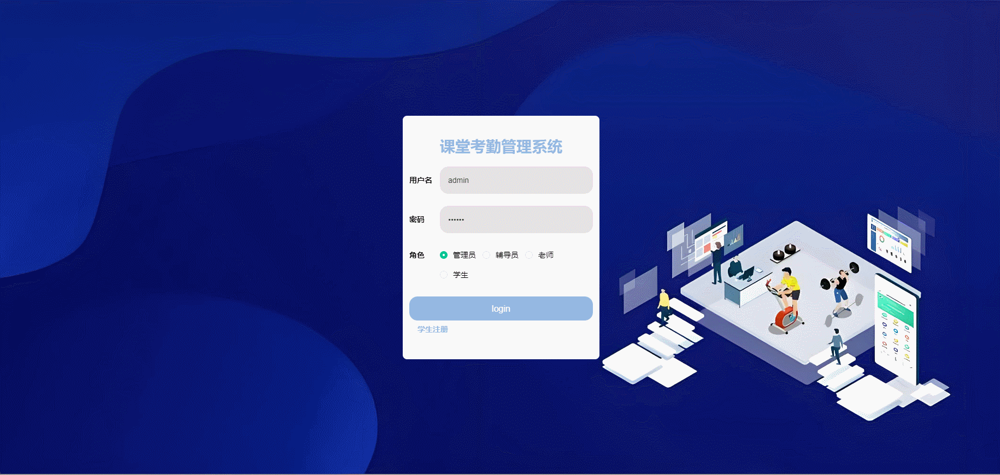

#  attendance🎂

基于SSM+Vue的课堂考勤系统

## 介绍🌞

> 课堂考勤管理系统集考勤记录与学分管理于一体，专为高校设计。系统涵盖系统管理员、辅导员、课堂老师、学生四大角色。管理员维护系统基础数据；辅导员监督学生出勤；老师实时记录考勤，关联学分；学生查看个人考勤与学分情况，促进学风建设。

## 项目演示🌞

> 学生


> 管理员



## 安装教程🌞

```
1. 运行环境准备mysql8 + java8 + node14.16.1 + redis

2. 配置maven路径，加载依赖

3. 运行sql文件，确保application.yml或config.properties的数据库名称和账号密码是数据库所在主机的账号密码
```


## 使用说明🌞

```
1. 登入

    管理员账号：admin 密码：123456

    辅导员账号：fudaoyuan1 密码：123456

    老师账号：laoshi 密码：123456

    学生账号：xuesheng1 密码：123456
  
2. 运行流程

SpringBoot+Vue项目的部署详情可以查看这篇CSDN博客：http://t.csdnimg.cn/kpuxS

前后端不分离项目的部署流程可以查看这篇CSDN博客：http://t.csdnimg.cn/CslA5
```


## CSDN项目合集🌞

点击前往：http://t.csdnimg.cn/Q4u84


## 联系我🌞

**有偿获取完整源码或调试代码**

🐧：1902317191

微信：


